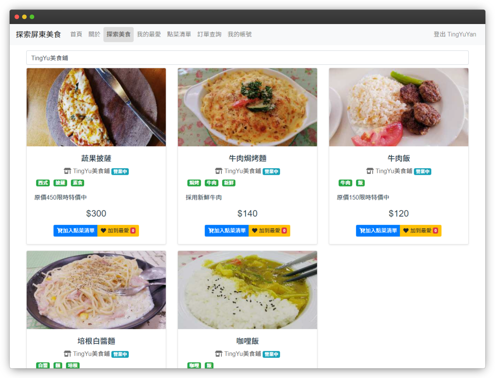
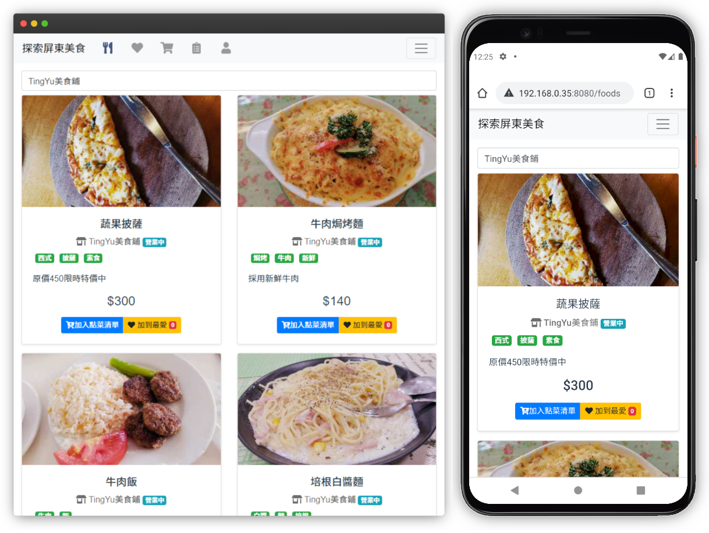
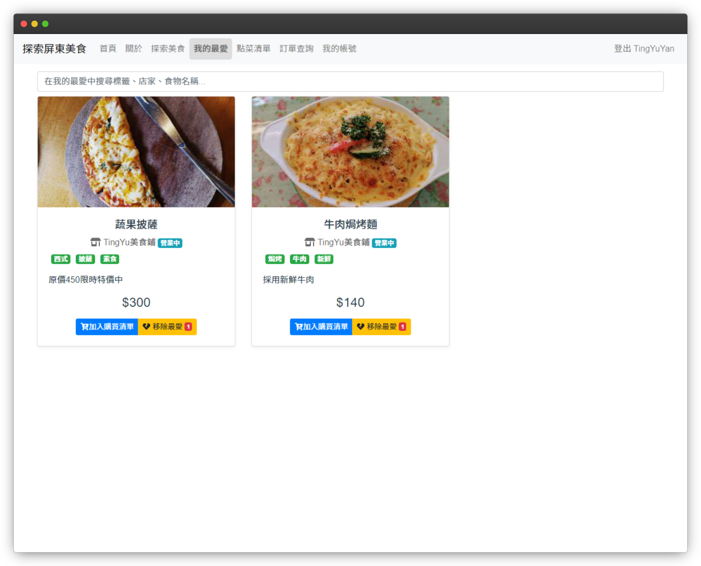
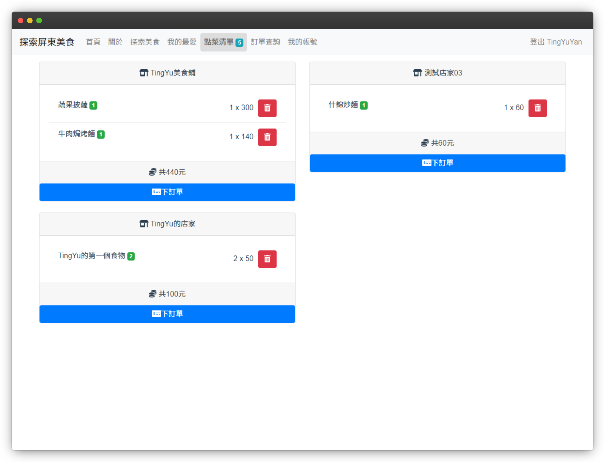
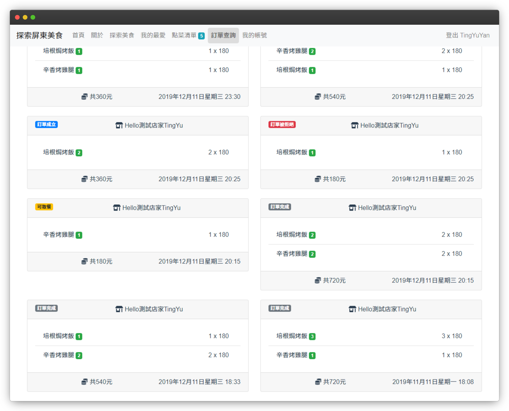
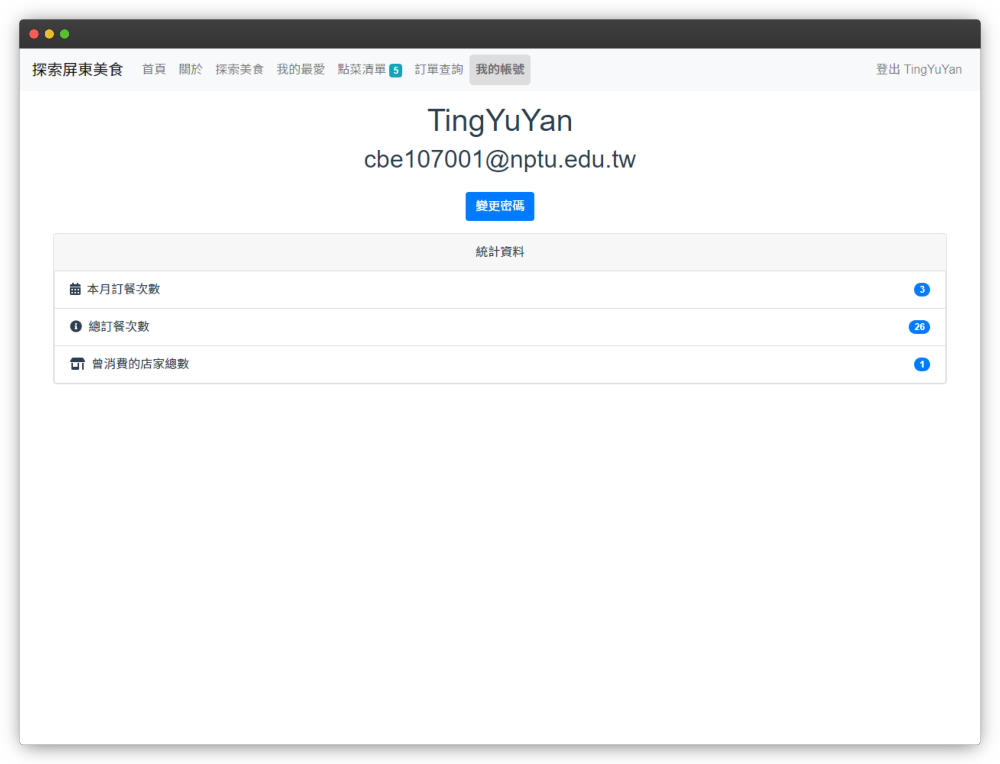
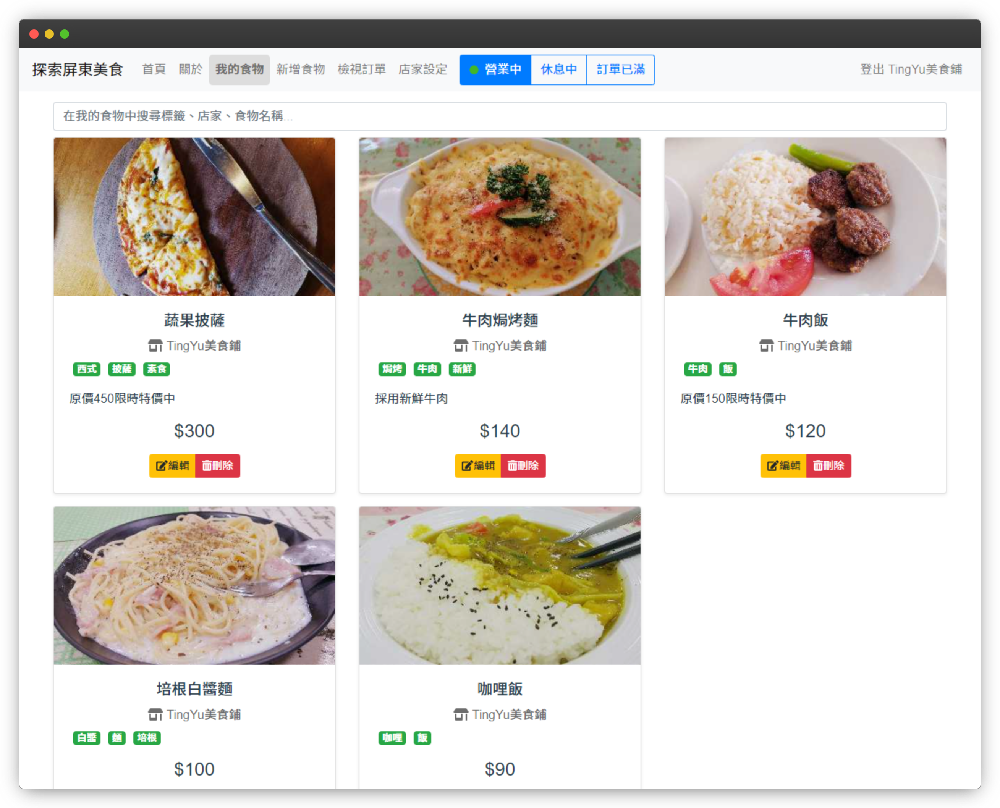
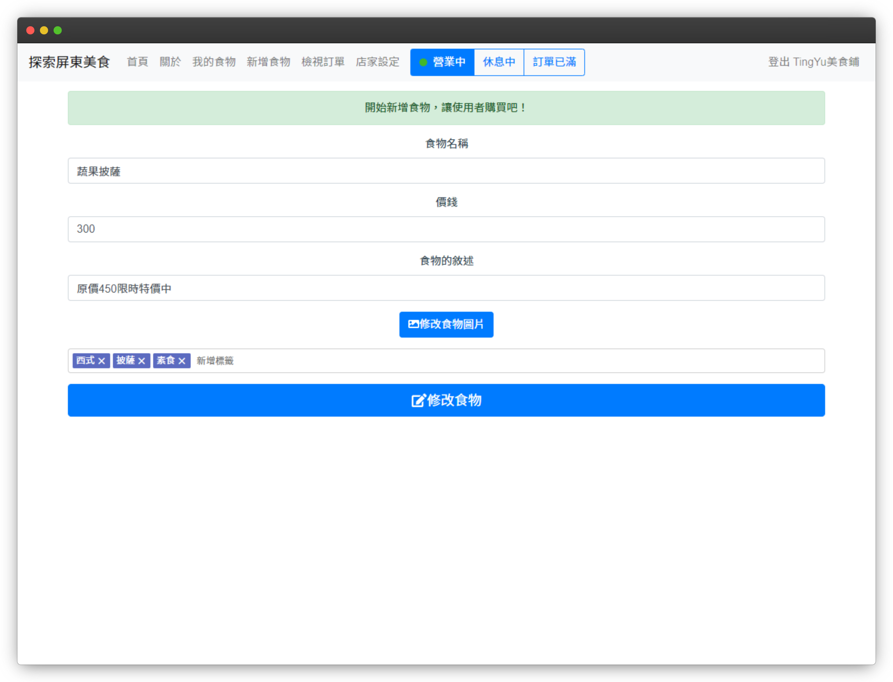
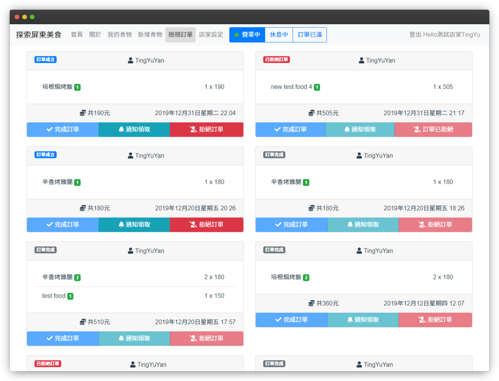
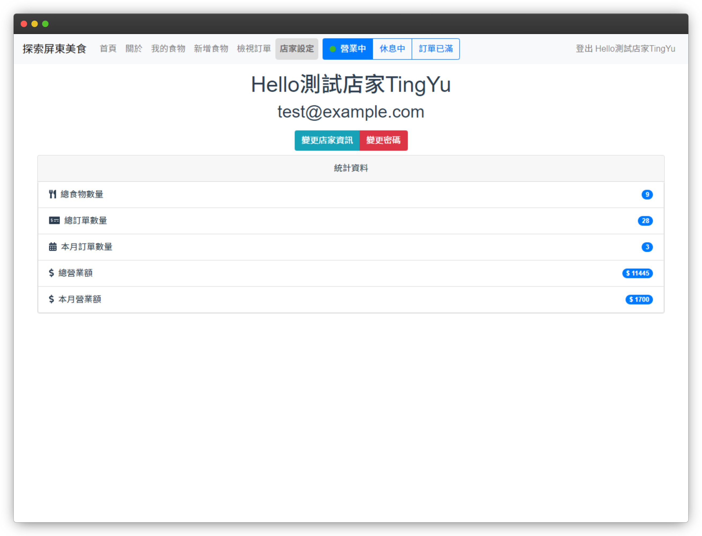

# Discover Pingtung Food

## Motivation
Food in Taiwan are delicious, but to buy them takes time and efforts. There may even be a multitude of people already queuing up in front of a recently-opened shop, and making the food you order also takes time. Wouldn't it be better if we can save those prescious time and do something productive?

**Discover Pingtung Food** comes to the rescue!

## Main Features
* Student
    * Discovery food shops nearby
    * Add favorite foods into favorite list
    * Order foods from one or multiple shops online
    * Get a notification when the ordered food is ready
* Shop
    * Advertise their foods
    * Receive order from students
    * Accept or reject order
    * Notify student when the food is ready

## Screenshots
### Responsive Web Design
Multiple screen sizes are supported using RWD (Responsive Web Design) technology.


### Student
#### Discover Food
Students can discover food nearby using discover page.

#### Favorites
Students can add food to their favorite list for easy access in the future.

#### Cart
Students can add food to the cart first and place the order later on, just like other e-commerce platforms.

#### Order List
Students can check their order list and will receive a notification when order state is changed.

#### Account & Statistics
Students can change their password and check their account statistics.

### Shop
#### My Foods
Shop owners can manage their foods.

#### Add/Edit Food
Shop owners can add or edit food to the platform.


#### Order List
Shop owners can check order list and will receive a notification when a new order comes. Shop owners can decide whether to accept the order or not. In addition, shop owners can set the state of their shop to one of the following:
* open - the shop is currently open and does accept order
* busy - the shop is currently busy and no longer receive new order
* closed - the shop is closed

#### Account & Statistics
Shop owners can change their shop name, password and check their account statistics. Every single change made to the foods, shop name, shop state are **immediately updated (synced) to all of the online clients** without the need to refresh the page thanks to websocket technology.


## Project setup
```
npm install
```

## Start server
```
export PORT=3030
export APP_ROOT=http://localhost:3030
export JWT_KEY=my_jwt_key
export ALLOWED_DOMAIN=nptu.edu.tw
export GMAIL_USER=<gmail username>
export GMAIL_PASS=<gmail password>
export DB_CONN="mongodb://[username:password@]host[:port]"
node index.js
```
## Front-end
Front-end code is at [this repo](https://github.com/tingyus995/pingtung-food-frontend).